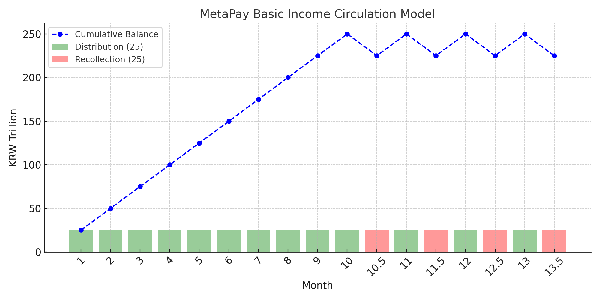

# metapayp2p-hyperion-clean on Metis Hyperion Testnet — Web3 Basic Income Simulation with AI & Peer Transfers

*(Powered by OpenAI API & Alith AI)*

---

## 🌍 Project Overview

metapayp2p-hyperion-clean is a Web3-based simulation of a circulating basic income system designed by Gyuha Yoon.  
Its purpose is to demonstrate a sustainable economic model where income is continuously circulated rather than endlessly printed.

- ✅ National Wallet distributes funds equally to 10 citizen wallets over 10 distribution rounds.  
- ✅ After every 10 distributions, 10% of citizen balances are recollected.  
- ✅ This Distribute → Recollect → Repeat cycle ensures sustainability.  
- ✅ Citizens are free to engage in peer-to-peer (P2P) transfers anytime, simulating a real economic ecosystem.  
- ✅ Alith AI monitors economic activity and warns of imbalances or risks.  
- ✅ OpenAI API powers AI-generated behavior logic and intelligent alerts.  

---

## 💡 Why MetaPay Matters

- 🔄 Demonstrates a tax-free, sustainable circulating basic income model.
- 🏛️ Offers a scalable concept for real-world pilot programs.
- 🤖 Integrates AI-driven behavior analysis for responsible financial interaction.
- 💬 Promotes transparent peer-to-peer economic activities on blockchain.

---

## 💹 MetaPay Circulation Model Overview

The chart below illustrates the MetaPay Basic Income Circulation Model:



- 🟩 Monthly distribution (green)  
- 🟥 Recollection every 10 rounds (red)  
- 🔵 Cumulative circulating balance (blue line)  

> This graph demonstrates how the balance grows with 10 cycles of distribution and stabilizes through periodic recollection, enabling a sustainable circulation model of basic income.

**Important:**  
In the MetaPay simulation, the national wallet must follow a strict cycle of **10 rounds of distribution followed by 1 round of recollection**, repeated continuously.  

If after 10 distributions and 1 recollection the **National Wallet balance remains at 4999**, the system requires **manual adjustment** by transferring **1 unit** from a **user wallet holding an odd amount of MetaPay** back to the National Wallet.  

This allows the next distribution to proceed normally.

> In real-life pilot projects, population increase or decrease may require manual adjustment accounts or automated balancing bots to stabilize the circulation system.

---

## 🏛️ Real-World Pilot Project Consideration

MetaPay’s model suggests implementing either:

- ✅ **Manual Adjustment Accounts** for population fluctuations  
- ✅ **Automated Balancing Bots** integrated with on-chain monitoring tools  

This allows seamless adaptation even in dynamic economic environments.

---

## 🛣️ Roadmap

- ✅ Phase 1: Simulation & AI Behavior Analysis (Completed)
- 🔄 Phase 2: Automated Balancing Mechanism (Planned)
- 🏛️ Phase 3: Institutional Pilot Testing with Governments/NGOs (Planned)

---

## 👥 Want to Join as a Tester?

We are onboarding testers for the next round of metapayp2p-hyperion-clean simulation.  
📧 Contact us at anioia33@gmail.com  

---

> “MetaPay is not just a simulation — it’s a vision for a freer, sustainable economy.”  
> — Gyuha Yoon, Creator of MetaPay  

---

## 🔧 Tech Stack

| Layer      | Technology                  |
|------------|------------------------------|
| Smart Contract | Solidity (Metis Hyperion Testnet) |
| Frontend  | React (Vite)                 |
| Backend   | Node.js + Express            |
| Blockchain| Metis Hyperion Testnet       |
| AI Integration | OpenAI API (analyze.js / server.js) |
| Wallet    | MetaMask                     |

---

## 📁 Project Structure

```
vite-project/
├── src/
│   ├── App.jsx              # Frontend Logic
│   └── abi.js               # Contract ABI & Address
├── ai-server/
│   ├── server.js            # OpenAI API Call Handler
│   └── analyze.js           # AI Logic
├── contracts/
│   └── metapayp2p_hyperion_clean.sol   # Solidity Smart Contract
├── public/
│   └── metapay_full_flow_chart.png
├── LICENSE
└── README.md
```
---

## 🆕 July 2025 Update Summary

- ✅ **AI Analysis Integrated**
  - Analyzes economic behavior across users, companies, and the national wallet.
  - Alerts generated by OpenAI API are shown in the top-right "AI Analysis Alerts" box.

- ✅ **National Wallet Distributions Included**
  - AI now incorporates distribution records from the national wallet.

- ✅ **New UI/UX Enhancements**
  - Real-time balance sync and transaction animations for better feedback.

- ✅ **Environment Configuration**
  - `.env` file must include your OpenAI API Key to enable analysis features.

📘 **Full User Guide:** [UserGuide.md](./UserGuide.md)

---

## 🚀 Getting Started

1️⃣ Install dependencies  
```bash
npm install
```

2️⃣ Run frontend (Vite)  
```bash
npm run dev
```

3️⃣ Run AI backend server  
```bash
cd ai-server
node server.js
```

---

## 🧠 Alith AI (Alice AI) — Behavior Analysis & Risk Warning

Alith AI acts as a behavior analysis engine that continuously monitors user transactions, P2P transfers, and corporate fund flows to detect potential risks or abnormal activities.  

It complements the OpenAI API by delivering context-aware warnings and balancing suggestions within the basic income simulation.

- 🧩 Analyzes transaction behaviors and P2P transfers  
- ⚖️ Monitors inflow vs. outflow for each corporate account  
- 📢 Generates risk warnings based on behavior patterns  
- 💬 Integrates with OpenAI API for natural language explanations  

---

## 🤖 AI-Driven Behavior Logic

With the power of OpenAI API, metapayp2p-hyperion-clean simulates intelligent interactions such as:

- 📊 Proportional transfers (e.g., salary)  
- 📉 Risk-based warnings for over-expenditure or liquidity issues  
- 📝 AI-generated suggestions for economic balancing  

---

## 📝 Smart Contract Details

- **Contract Source:** `metapayp2p_hyperion_clean.sol`  
- **🔥 Deployed Address:** `0x538253A02f37328e07B13edaF7133a2A5CDF03b8` *(Metis Hyperion Testnet)*  
- **🔗 Smart Contract on Explorer:** https://explorer.hyperion.metis.io/address/0x538253A02f37328e07B13edaF7133a2A5CDF03b8  
- **Deployment Tool:** Remix IDE  
- **ABI Source:** `/src/abi.js`  

**Core Functions:**  
- National fund distribution  
- Peer-to-peer transaction handling  
- Corporate account tracking & recollection logic  
- Transaction record logging for AI analysis  

---

## 🗂️ Test Wallet Addresses

### 🧑 User Wallets  

- `0xcAEc83c59b3FbfE65cC73828e9c89b9c07902105`  
- `0x3C39f84a28673bdbA9f19eaAd26e04d95795260C`  
- `0x9D2b9Acad30E1D2a0bb81e96816506C166F2076A`  
- `0x37f047f304B49cE83b5630BCb1D6DF4b05eeD305`  
- `0x4194b9E02e733f112b2b44f40554DAB0EA60b470`  
- `0xc95132B717cFCac125423e07429e8894D18c357B`  
- `0xA0831b8e8628b2C683cd98Fd17020d2376582073`  
- `0x5317F13e44d02E44c899010D4Fb11985657c26D8`  
- `0x4f4728FA3FF45b5459Bfb64C5CD0D78FaEBe12f6`  
- `0xA80E21304603C453f416bE77b210ED0AFf400ed7`  

### 🏢 Company Wallets  

- `0x235a5a253873e1DfDE4AB970C3C8bBDB4A962b5b`  
- `0x65077De588c690D2BAA9c83B783E378445B69C18`  
- `0x8266893251a5CEa9b88701044aa5D8b1D1a9C64f`  
- `0xb18BAdd5FeBe08489c7F0aFc54c77e55133360ce`  
- `0x527F433024e646e44d479D4396D53B5544D88D84`  

---

## 🔗 Links

- 📝 **GitHub Repository:** [metapayp2p-hyperion-clean2](https://github.com/metapaygyuhas/metapayp2p-hyperion-clean2)  
- ▶️ **YouTube Channel:** MetaPay Project  
- 🔥 **💻 Live DApp:** [https://metapayp2p-hyperion-clean2.vercel.app](https://metapayp2p-hyperion-clean2.vercel.app)  
- ❌ **Twitter (X):** [@metapay_creator](https://x.com/metapay_creator)  

## 🤖 AI Server Deployment Info

- The AI backend is **already deployed** on Render for automated behavior analysis:
  - **Render Endpoint:** https://metapay-openai-backend.onrender.com  
- The frontend is **pre-configured** to call this deployed AI backend automatically.
- **No local AI server setup is required** for running the demo — simply run the frontend.
- AI backend code is **not pushed to GitHub** for security reasons (contains `.env` with API keys).
- For review purposes, the backend code can be provided privately upon request.


## 📄 Official User Guide (Must Read)

[📄 MetaPayP2P User Manual (Google Drive)](https://drive.google.com/file/d/1SAVL8EIXByRPtT2VqP7soc3sPb3JSiUK/view?usp=sharing)

---
---
## ℹ️ Note on Cash Handling

The **cash transfer simulation** (💵) is handled entirely on the **frontend** for demonstration purposes only.  
This allows flexible scenario creation for demo videos and user testing.  
All **MetaPay (🪙)** transactions — including distributions and recollections — are processed via **on-chain smart contracts**.

> 📝 The frontend cash logic does not affect blockchain behavior or smart contract operations.

---
---

## ⚖️ Enhanced License Notice

© 2025 Gyuha Yoon — MetaPay Project for HyperHack

This project, including but not limited to its code, architecture, algorithms, 
economic model, and simulation logic, is protected under copyright law 
and is licensed under a modified MIT License with strict Commercial and Policy Use Restrictions.

❗ **Commercial or policy-level use is strictly prohibited without explicit written permission.**

Prohibited uses include, but are not limited to:
- Implementation of the core circulation model (10 distributions + 1 recollection cycle) in any commercial product or public policy program.
- Replication of the forced mixed-payment system (e.g., 50% MetaPay + 50% cash) in any real-world or simulated economy.
- Any government, NGO, or corporate adoption of the system for basic income or related economic programs without a licensing agreement.
- Modification, translation, or adaptation of the underlying model for the purpose of commercial or institutional deployment.

For licensing inquiries, contact: anioia33@gmail.com

Violation of this license may result in legal action, including claims for damages and injunctions.

---

## 📢 Contact  

📧 anioia33@gmail.com  
GitHub: [metapaygyuhas](https://github.com/metapaygyuhas)  
Twitter: [@metapay_creator](https://x.com/metapay_creator)

---

## 🪐 [FOR METIS — Hyperion Hackathon]

This project is also being submitted to the **Metis Hyperion Hackathon**.

metapayp2p-hyperion-clean offers a novel approach to public finance simulation within DAO ecosystems, showcasing how smart contracts and AI can enable autonomous, transparent basic income distribution across a decentralized society.

This version emphasizes on-chain interaction, AI risk detection, and DAO-compatible fund flows — aligned with Metis' Layer 2 mission.

---

## 🏛️ [FOR NLNET — Open Source Support Application]

This project has also been submitted to the **NLnet Foundation** as part of its Open Source and Public Digital Infrastructure Initiative.

metapayp2p-hyperion-clean addresses economic imbalance at scale through a government-grade circulating basic income model. While not intended for individual use, it is designed for **policy simulation and national-level pilot experiments**.

The system is:
- Fully open source
- Operates with smart contract automation
- Integrated with AI for governance and risk alerts
- Designed for long-term public experimentation
